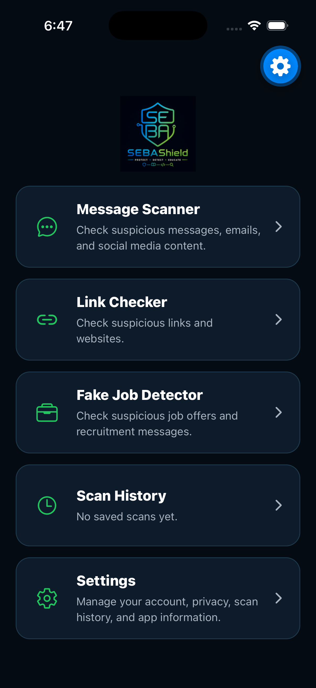
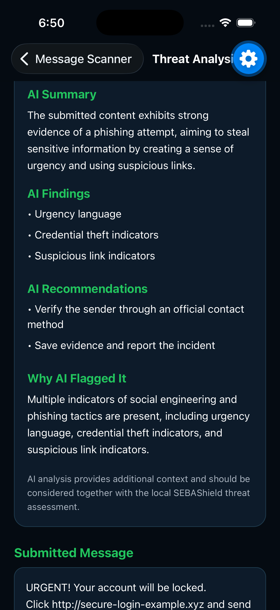
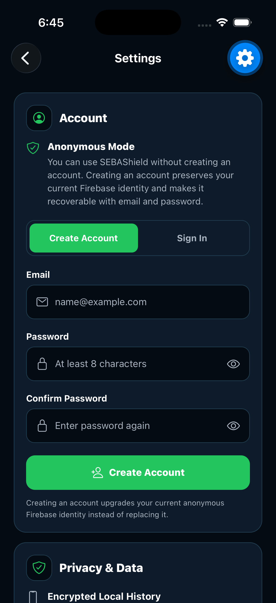
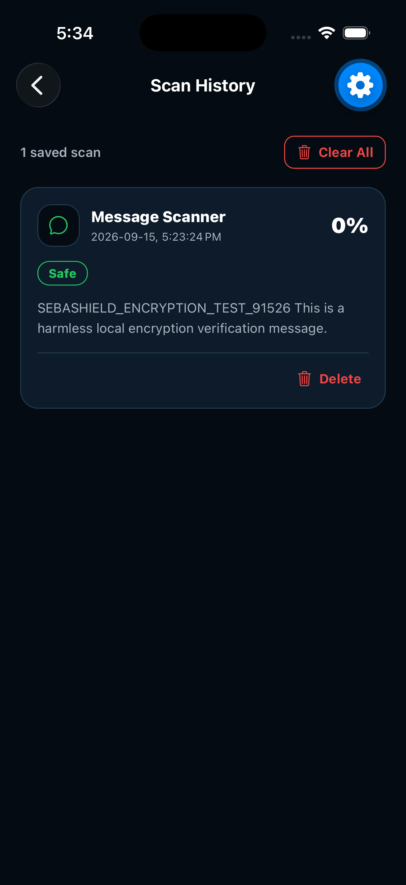
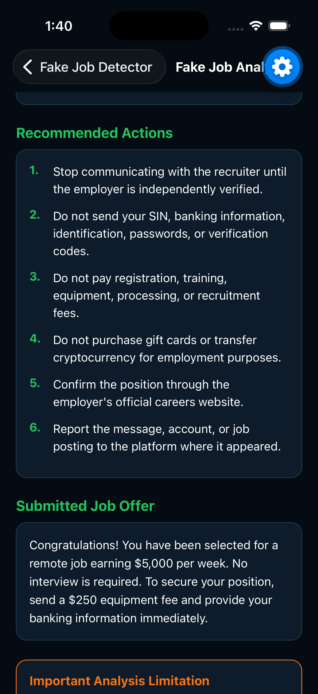

SEBAShield
Detect. Analyze. Protect. Educate.
SEBAShield is a React Native + Expo mobile cybersecurity application for analyzing suspicious messages, links, and job offers. The app runs natively both  on iOS and Android from a single React Native codebase.
The app combines deterministic local analysis with optional AI-assisted analysis. The local rules engine remains the primary baseline; AI provides supplemental context and does not replace the local result.
Features
•	Message scam analysis
•	Link / URL checking
•	Fake-job detection
•	Deterministic local scoring and risk classification
•	Optional AI-assisted analysis
•	Encrypted device-local scan history
•	Firebase anonymous authentication
•	Email/password accounts
•	Anonymous-to-email account upgrade
•	Email verification and password reset
•	Privacy-minimized Firestore synchronization
•	Metadata-only cloud history recovery after sign-in
•	Individual scan deletion
•	Clear-all scan history
•	Settings and account-management controls
Technology
Mobile application
•	React Native
•	Expo
•	React Navigation
•	JavaScript
•	Firebase Authentication
•	Cloud Firestore
•	Expo SecureStore
•	Expo Crypto
AI backend
•	Cloudflare Workers
•	Workers AI
•	TypeScript
•	Vitest
•	Firebase ID-token verification
•	User and network rate limiting
Architecture
SEBAShield uses a feature-oriented structure.
SEBAShield/
├── App.js
├── index.js
├── app.json
├── assets/
├── docs/
│   ├── FirebaseStructure.md
│   ├── PrivacyModel.md
│   ├── Roadmap.md
│   └── Wireframes.md
├── ai-backend/
│   ├── src/
│   ├── test/
│   ├── package.json
│   ├── tsconfig.json
│   └── wrangler.jsonc
└── src/
    ├── app/
    │   ├── config/
    │   ├── navigation/
    │   └── providers/
    ├── features/
    │   ├── aiAnalysis/
    │   ├── alerts/
    │   ├── authentication/
    │   ├── communityReports/
    │   ├── history/
    │   ├── scanning/
    │   ├── settings/
    │   └── threatIntelligence/
    ├── infrastructure/
    │   ├── firebase/
    │   ├── logging/
    │   ├── networking/
    │   ├── security/
    │   └── storage/
    └── shared/
        ├── components/
        ├── constants/
        ├── errors/
        ├── styles/
        └── utils/
See src/README.md for architecture details.
Privacy and Data Handling
SEBAShield intentionally separates rich local scan data from reduced cloud metadata.
Local history
The device-local history can contain the submitted message, URL, or job text and the complete local analysis required by the UI.
Local history is encrypted before persistence using AES-256-GCM. The local encryption key is stored separately with Expo SecureStore. Android application backup is disabled.
Firestore
Firestore stores a reduced representation of a scan rather than the complete local scan record.
The cloud record is designed to contain fields such as:
•	scan ID
•	Firebase owner UID
•	scan type
•	score
•	risk level
•	normalized indicator codes
•	analyzer/schema version
•	timestamps
The cloud representation intentionally excludes raw submitted content, local content previews, free-text recommendations, free-text indicator descriptions, AI summaries, AI explanations, and local encryption material.
Cloud history recovery
When an email-account user signs out, the device-local raw scan history is cleared.
When the user signs back into the same Firebase account, SEBAShield can retrieve that account's Firestore metadata and display metadata-only Cloud Record entries.
Raw submitted content is not reconstructed from Firestore.
AI analysis
When optional AI analysis is requested, the submitted content is transmitted to the configured authenticated AI backend for that inference request.
SEBAShield does not intentionally persist raw submitted content or raw AI request content in Firestore.
For a more detailed engineering description, see docs/PrivacyModel.md.
Authentication
Supported Firebase Authentication workflows include:
•	anonymous authentication
•	email/password account creation
•	upgrading an anonymous identity to email/password
•	email/password sign-in
•	email verification
•	password reset
•	sign-out
Cloud scan ownership is based on the authenticated Firebase UID.
History Deletion
SEBAShield uses a cloud-first deletion strategy when authentication is available.
For an individual scan:
1.	Verify the current Firebase identity.
2.	Delete the matching Firestore scan document.
3.	Delete the encrypted local copy if one exists.
4.	Refresh the combined history view.
For Clear Scan History:
1.	Verify Firebase Authentication.
2.	Retrieve the current user's Firestore scans.
3.	Delete the cloud scan documents.
4.	Clear encrypted local history and its local key.
5.	Reset in-memory history state.
This prevents the app from reporting permanent deletion while a cloud record is known to remain.
Environment Configuration
Copy .env.example to a local .env file and provide the required environment values. Never commit the populated .env file.
Do not commit:
•	.env
•	.env.save
•	Firebase service-account keys
•	Cloudflare secrets
•	private credentials or tokens
Client-side Firebase web configuration is not treated as an authorization mechanism. Access control depends on Firebase Authentication and Firestore Security Rules.
Run the Mobile App
npm install
npx expo start -c

Export Validation Checks

npx expo export --platform ios --output-dir /tmp/sebashield-ios-final
npx expo export --platform android --output-dir /tmp/sebashield-android-final
AI Backend Validation
Run backend checks from the backend directory:
cd ai-backend
npx tsc --noEmit
npm test -- --run
The backend tests cover health and important request-rejection behavior. Additional integration and security tests remain appropriate future work.
Security Notes
Current defensive controls include:
•	encrypted local history
•	SecureStore key storage
•	Android backup disabled
•	UID-scoped Firestore access
•	minimized Firestore schema
•	Firebase ID-token verification on the AI backend
•	request validation
•	user rate limiting
•	network rate limiting
•	no-store response headers for AI responses
•	cloud-first deletion behavior
These controls are engineering safeguards, not a formal security certification or guarantee.
Limitations
SEBAShield is a capstone application.
A Safe or low-risk result does not prove that content is trustworthy. Automated and AI-assisted results can be incomplete or incorrect.
Users should independently verify suspicious links, employers, payment requests, account-security messages, and other high-impact situations.
Documentation
•	docs/FirebaseStructure.md — Firestore structure, ownership, synchronization, and deletion
•	docs/PrivacyModel.md — local/cloud/AI data flows and retention
•	docs/Roadmap.md — implemented scope and future work
•	docs/Wireframes.md — screen and navigation flows
•	src/README.md — source-code architecture

SEBAShield/
│
├── README.md
│   → Whole project overview
│
├── src/
│   └── README.md
│       → Source-code architecture
│
└── docs/
    ├── PrivacyModel.md
    │   → Privacy and data flow
    │
    ├── FirebaseStructure.md
    │   → Firebase / Firestore design
    │
    ├── Roadmap.md
    │   → Current and future development
    │
    └── Wireframes.md
        → Screen and navigation design

## Screenshots

### Home Screen

### AI Link Analysis

### Settings and Account

### Scan History

### Fake Job Guidance

Author
Wubit
Mobile Web Development Capstone Project
